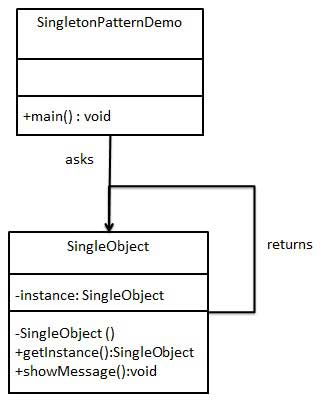

# Singleton

单列模式

- 模式意图：保证一个类只有一个实例，并且提供一个全局访问点。
- 主要解决：一个全局使用的类频繁地创建与销毁。
- 何时使用：当您想控制实例数目，节省系统资源的时候。
- 如何解决：判断系统是否已经有这个单例，如果有则返回，如果没有则创建。
- 关键代码：构造函数是私有的。

### 优点

- 在内存里只有一个实例，减少了内存的开销，尤其是频繁的创建和销毁实例。
- 避免对资源的多重占用（比如写文件操作）。

### 缺点

- 没有接口，不能继承，与单一职责原则冲突，一个类应该只关心内部逻辑，而不关心外面怎么样来实例化。

### 使用场景

- 需要严格控制全局变量时
- 重量级的对象，如线程池对象、数据库链接池对象；不需要多个实例的对象，比如工具类。

### UML

## Reference

https://www.runoob.com/design-pattern/design-pattern-tutorial.html

https://refactoring.guru/design-patterns
